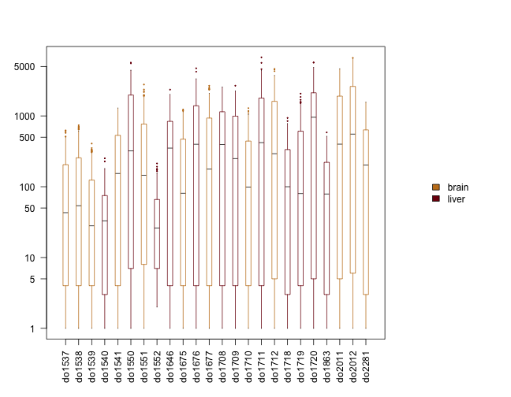
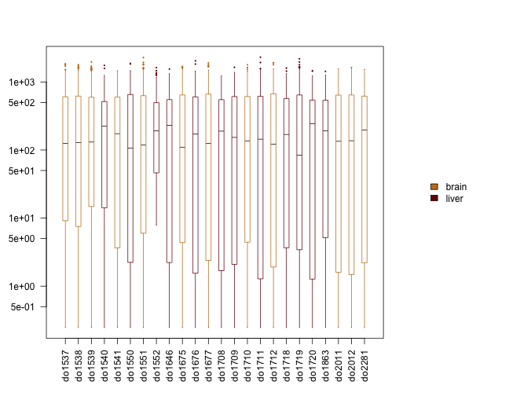
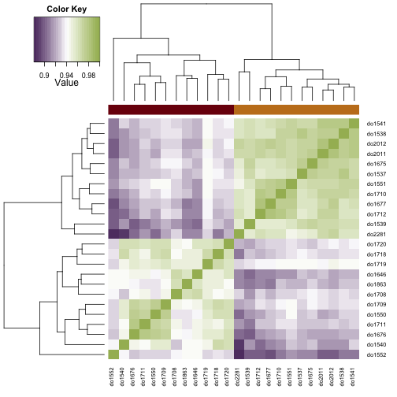
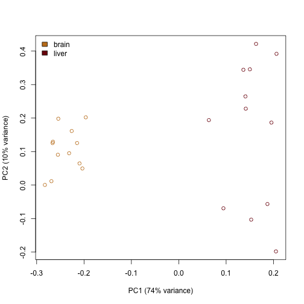
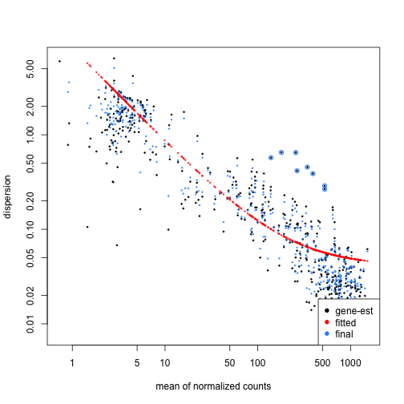
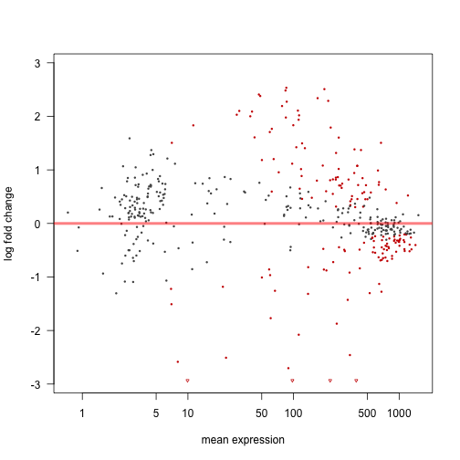
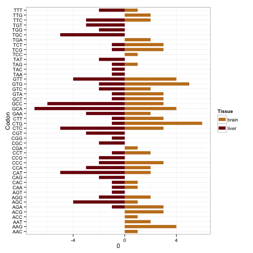

Genomic analysis using R and knitr
==================================

Introduction
------------

This is an example document showing how [knitr][] can make biological analysis
easier to understand and reproduce. Do make sure to read [the source
code][source] of this document as well, since it shows how to write knitr source
code. This document was created using the command


```r
knitr::knit2html('deseq.rmd')
```

The following shows the protocol, execution and results of a
simple gene expression analysis.

The data used in this project is from [*Schmitt, Rudolph & al.* (Genome Res
2014)][Schmitt2014]. We use [DESeq2][] to analyse changes of tRNA gene
expression across two tissues and several stages of mouse embryonic development.
For a full description of the data, please refer to the above-mentioned paper.

First look at the data
----------------------

To start off the analysis, let’s examine the data. We can do this in a terminal
and/or third party applications but we can also do it directly in R. The data
is stored in the `data` subdirectory:


```r
dir('data')
```

```
## [1] "library-design.tsv"  "trna-annotation.tsv" "trna-counts.tsv"
```

Let’s have a look at the library design.


```r
design = read.delim('./data/library-design.tsv', header = FALSE,
                    col.names = c('Library', 'Antibody', 'Tissue', 'Stage'))
head(design)
```


| Library   | Antibody   | Tissue   | Stage   |
|:----------|:-----------|:---------|:--------|
| do1532    | Input      | liver    | e15.5   |
| do1533    | Input      | brain    | P4      |
| do1534    | Input      | liver    | P22     |
| do1537    | PolIII     | brain    | e15.5   |
| do1538    | PolIII     | brain    | e18.5   |
| do1539    | PolIII     | brain    | P0.5    |

We’re dealing with a ChIP-seq dataset, which was created using an antibody for
a subunit of the polymerase III complex. The study by *Schmitt, Rudolph & al.*
used active binding of pol III as a measure of gene expression activity for
tRNA genes, since it is known that binding of pol III to tRNA gene regions
correlates very well with gene expression strength.

So although this is a ChIP-seq dataset, the read counts actually quantify gene
expression, more akin to RNA-seq data. Since we are interested in comparing
gene expression between different conditions, the input libraries are not
relevant for now, so we filter them out.

For data manipulation, I recommend the excellend [dplyr][] library. It’s fast
becoming established as a *de facto* standard, and it produces very readable
code by chaining several operations on the same data via the `%>%` operator. For
instance, the following simply filters our data frame by a given criterion.


```r
library(dplyr)

design = design %>% filter(Antibody != 'Input')
head(design)
```


| Library   | Antibody   | Tissue   | Stage   |
|:----------|:-----------|:---------|:--------|
| do1537    | PolIII     | brain    | e15.5   |
| do1538    | PolIII     | brain    | e18.5   |
| do1539    | PolIII     | brain    | P0.5    |
| do1540    | PolIII     | liver    | P4      |
| do1541    | PolIII     | brain    | P4      |
| do1550    | PolIII     | liver    | P22     |

Next, we load the actual count data of the sequencing libraries, and drop all
the input libraries right away. Since there are many columns, we only print a
subset to get an idea of the data layout:


```r
counts = read.delim('./data/trna-counts.tsv', row.names = 1)
lib_indices = match(colnames(counts), design$Library)
counts = counts[, lib_indices]
counts[1 : 6, 1 : 6]
```


| &nbsp;              |   do1537 |   do1538 |   do1539 |   do1540 |   do1541 |   do1550 |
|:--------------------|---------:|---------:|---------:|---------:|---------:|---------:|
| **chr1.trna1000**   |      199 |      259 |      110 |      179 |      711 |     1694 |
| **chr1.trna1001**   |      149 |      168 |       70 |      251 |      518 |     2893 |
| **chr1.trna1002**   |       95 |       87 |       54 |       90 |      172 |     1252 |
| **chr1.trna1004**   |      192 |      202 |      137 |       92 |      504 |     2506 |
| **chr1.trna1005**   |      192 |      219 |      102 |       65 |      491 |     1670 |
| **chr1.trna1006**   |      511 |      584 |      247 |       99 |     1012 |     3020 |

DESeq
-----

Now it’s time to bring out a library to work with expression count data:


```r
library(DESeq2)
```

For a detailed description of DESeq2, refer to the vignette, using the R
command


```r
vignette('DESeq2')
```

In order to compare count data of different libraries, we need to normalise
their counts to account for library size effects. In order to see why this is
the case, let’s look at the distribution of the raw counts across libraries:


```r
# Color the libraries by their tissue identity.
tissue_colors = c(brain = '#C47E1F', liver = '#7C0D0C')

layout(matrix(c(1, 2), nrow = 1), widths = c(0.8, 0.2))
par(mar = c(5, 4, 4, 2) + 0.1)
# Add pseudocount 1, because zeros would break log y axis.
boxplot(counts + 1, las = 2, log = 'y', col = tissue_colors[design$Tissue])
par(mar = c(5, 0, 4, 2) + 0.1)
plot.new()
legend('center', bty = 'n', legend = names(tissue_colors), fill = tissue_colors)
```

 

… the count distributions differ drastically between libraries! This is due to
technical variation during sequencing that we cannot influence. Normalisation
takes care of this. But this requires us first to put the data into a DESeq2
analysis object.


```r
de_count_data = DESeqDataSetFromMatrix(counts, design, design = ~Tissue)
```

```
## Warning in DESeqDataSet(se, design = design, ignoreRank): some variables
## in design formula are characters, converting to factors
```

The last parameter in the above call already specifies what we are going to
contrast later. We ignore it for now.

Now we can run the library size normalisation on this.


```r
de_count_data = estimateSizeFactors(de_count_data)
counts = counts(de_count_data, normalized = TRUE)
# DESeq2 removes column names, we need to re-set them.
colnames(counts) = design$Library[lib_indices]

layout(matrix(c(1, 2), nrow = 1), widths = c(0.8, 0.2))
par(mar = c(5, 4, 4, 2) + 0.1)
# Use global minimum value > 0 as pseudocount.
eps = min(counts[counts > 0])
boxplot(counts + eps, las = 2, log = 'y', col = tissue_colors[design$Tissue])
par(mar = c(5, 0, 4, 2) + 0.1)
plot.new()
legend('center', bty = 'n', legend = names(tissue_colors), fill = tissue_colors)
```

 

Comparison between samples
--------------------------

Next, we can calculate similarities between our samples and plot those.


```r
library(gplots)
correlated = cor(counts, method = 'spearman')
heatmap.2(correlated, ColSideColors = tissue_colors[design$Tissue])
```

 

As the horizontal colour bar at the top indicates, tRNA gene expression
perfectly separates the libraries according to their tissue identity. We can
visualise the variance of the gene expression by performing principal components
analysis on this data set:


```r
pcs = prcomp(correlated)
explained_variance = summary(pcs)$importance['Proportion of Variance', ]
plot(PC2 ~ PC1, pcs$x,
     col = tissue_colors[design$Tissue], pch = 1,
     xlab = sprintf('PC1 (%.0f%% variance)', explained_variance[1] * 100),
     ylab = sprintf('PC2 (%.0f%% variance)', explained_variance[2] * 100))
legend('topleft', bty = 'n', legend = names(tissue_colors),
       fill = tissue_colors)
```

 

Next, it makes sense to look at which genes cause this difference **between the
tissues** by performing differential expression analysis using tissue identity
of each library as the contrast (this is what we specified with the `design =
~Tissue` argument earlier).


```r
dds = DESeq(de_count_data)
```

```
## using pre-existing size factors
## estimating dispersions
## gene-wise dispersion estimates
## mean-dispersion relationship
## final dispersion estimates
## fitting model and testing
```

```r
plotDispEsts(dds)
```

 

```r
res = results(dds)
plotMA(res, alpha = 0.05)
```

 

The DESeq2 vignette explains the function of these plots in detail; the
important part for us are the red dots in the second plot – these correspond to
significantly differentially expressed tRNA genes, at the 5% significance level.
The number of these differentially expressed genes is 168 (out of 433). The top hits (by FDR-adjusted
*p*-value) are:


```r
res = res %>% as.data.frame() %>% add_rownames('Gene')
res %>% arrange(padj) %>%
    select(Gene,
           `Base mean` = baseMean,
           `log2 Fold change` = log2FoldChange,
           `Adjusted p` = padj) %>%
    head()
```


| Gene           |   Base mean |   log2 Fold change |   Adjusted p |
|:---------------|------------:|-------------------:|-------------:|
| chrX.trna375   |       222.1 |             -7.585 |   1.015e-164 |
| chr1.trna730   |       392.3 |             -7.422 |    8.454e-77 |
| chr13.trna973  |       377.6 |              1.383 |    1.093e-47 |
| chr11.trna1849 |       89.35 |             -2.703 |    1.249e-40 |
| chr13.trna974  |       267.9 |              1.603 |    9.825e-40 |
| chr13.trna109  |         213 |              2.289 |    3.561e-30 |

Relating the data to biological features
----------------------------------------

We can now use the tRNA gene annotation to find out which anticodons are
over-represented amongst the significantly differentially expressed genes.


```r
annotation = read.delim('./data/trna-annotation.tsv', header = FALSE)

# The data is messy. Remove redundant spaces etc.
annotation = annotation %>%
    mutate(Gene = paste0(V1, sub(' ', '', V2))) %>%
    select(Gene, Codon = V7, AA = V6, Chr = V1, Start = V4, End = V5) %>%
    mutate(AA = gsub(' ', '', AA))

head(annotation)
```


| Gene          | Codon   | AA   | Chr   |    Start |      End |
|:--------------|:--------|:-----|:------|---------:|---------:|
| chr1.trna1000 | GTC     | Asp  | chr1  | 1.73e+08 | 1.73e+08 |
| chr1.trna1001 | TCC     | Gly  | chr1  | 1.73e+08 | 1.73e+08 |
| chr1.trna1002 | CTC     | Glu  | chr1  | 1.73e+08 | 1.73e+08 |
| chr1.trna1004 | TCC     | Gly  | chr1  | 1.73e+08 | 1.73e+08 |
| chr1.trna1005 | GTC     | Asp  | chr1  | 1.73e+08 | 1.73e+08 |
| chr1.trna1006 | GTT     | Asn  | chr1  | 1.73e+08 | 1.73e+08 |

To find the number of differentially expressed genes per codon, we merge these
two tables and group by codon type.


```r
differential_codons = inner_join(res, annotation, by = 'Gene') %>%
    filter(! is.na(padj) & padj < 0.05) %>%
    group_by(Codon) %>%
    summarize(AA = first(AA),
              brain = sum(log2FoldChange > 0),
              liver = sum(log2FoldChange < 0))

head(differential_codons)
```


| Codon   | AA   |   brain |   liver |
|:--------|:-----|--------:|--------:|
| AAC     | Val  |       1 |       0 |
| AAG     | Leu  |       4 |       0 |
| AAT     | Ile  |       2 |       0 |
| ACC     | Gly  |       1 |       0 |
| ACG     | Arg  |       3 |       0 |
| AGA     | Ser  |       3 |       1 |

This table shows the number of overrepresented genes for brain and liver,
respectively.

Let’s visualise this more nicely. For that, we need to re-shape the data and
pass it to `ggplot`, which provides more powerful visualisation capabilities.


```r
library(reshape2)
codons_plot_data = differential_codons %>%
    mutate(liver = -liver) %>%
    melt(id.vars = c('Codon', 'AA'), variable.name = 'Tissue',
         value.name = 'Value')

library(ggplot2)
ggplot(codons_plot_data,
       aes(x = Codon, xend = Codon, y = 0, yend = Value, color = Tissue)) +
    geom_segment(size = 3) +
    coord_flip() +
    scale_color_manual(values = tissue_colors) +
    theme_bw()
```

 

We can also group the anticodons by their corresponding amino acid:


```r
ggplot(codons_plot_data,
       aes(x = Codon, xend = Codon, y = 0, yend = Value, color = Tissue)) +
    geom_segment(size = 3) +
    facet_wrap(~AA, scales = 'free_x') +
    scale_color_manual(values = tissue_colors) +
    theme_bw()
```

 

Closing remark
--------------

At this point we would start investigating the differences we see between
individual anticodons and amino acid types, write up a paper about it, and
submit it to *Cell*. Good luck.

(Thanks to [Nils][] and [Maria][] for help with ggplot2, which I know nothing
about.)

<!-- References -->

[source]: ./deseq.rmd?raw=true
[Schmitt2014]: http://www.genome.org/cgi/doi/10.1101/gr.176784.114
[knitr]: http://yihui.name/knitr/
[DESeq2]: http://www.bioconductor.org/packages/release/bioc/html/DESeq2.html
[dplyr]: http://cran.rstudio.com/web/packages/dplyr/vignettes/introduction.html
[Nils]: https://github.com/koelling
[Maria]: https://github.com/mxenoph
